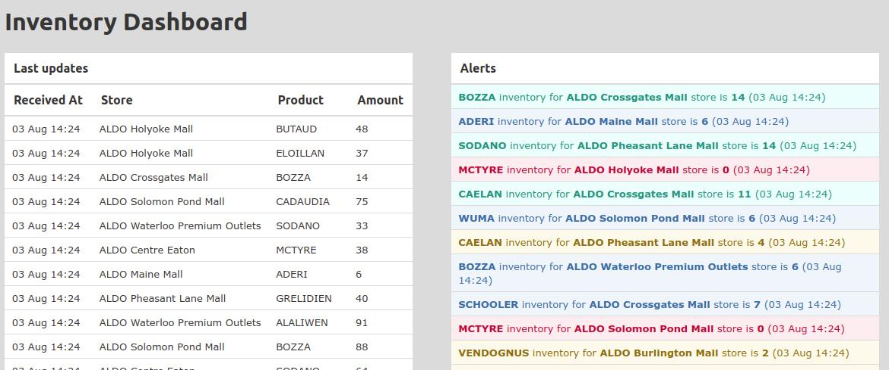

# README

## Instructions
- Make sure websocket is running (bin/websocketd --port=8080 ruby inventory.rb) on shoe-store repo
- On a separate terminal, run `rake ws_listener` to connect to websocket and receive events
- On another terminal window, run `bundle exec sidekiq -C config/sidekiq.rb` to start Sidekiq
- Run `rails s` to start Rails server
- Open *http://localhost:3000/dashboard* to open the inventory dashboard

The dashboard page should look similar to this

### Cron Jobs
- Some jobs are scheduled on *config/schedule.yml*. They execute some actions and send updates to dashboard.
